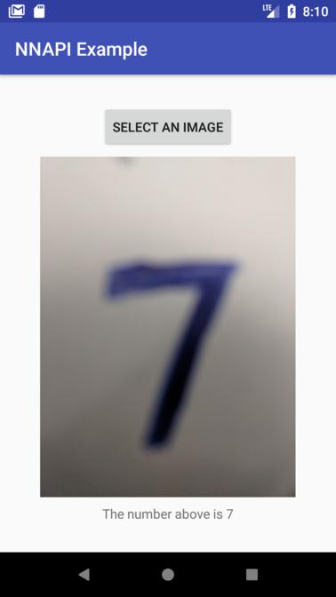

# NNAPI Example

*Run neural network on your Android phone using the new NNAPI !*

Android 8.1 introduces Neural Networks API (NNAPI). Though it is in beta, it's very exciting to run a model in the "native" way supported by Android System. :)

This project is a simple demo of NNAPI. It uses extracted weights of LeNet and recongnize a handwritten number. I extracted the pretrained weights using pycaffe and then changed the data layout according to the [document](https://developer.android.com/ndk/reference/group___neural_networks.html#gab95e96267e0f955086b87a743dad44ca).

## Screenshot

This screenshot is from `pick_an_image` branch, which lets user pick an image instead of using camera.

This screenshot is from `master` branch, which uses camera.

## Preparation

Please make sure the Android System on your phone is 8.1+, or you may want to use API 27 emulator.
